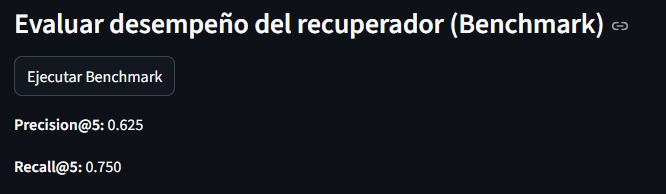
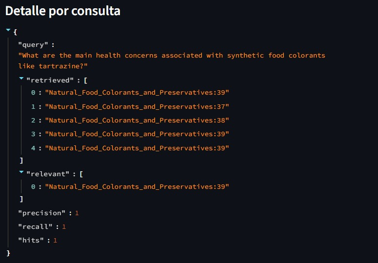

# Proyecto Aplicado I --- Pipeline RAG para Biotecnologías y Compuestos Bioactivos

## Autores

-   Ordelis Lameda\
-   Sebastián Cabezón\
-   Byron Hidalgo

## Descripción General

Este proyecto implementa un sistema **RAG (Retrieval-Augmented
Generation)** especializado en literatura científica relacionada con
biotecnologías y compuestos bioactivos. Incluye ingestión de PDFs,
procesamiento, chunking, embeddings, almacenamiento vectorial en Qdrant,
recuperación con MMR y una interfaz en Streamlit.

## Objetivos

### Objetivo General

Construir un sistema RAG capaz de responder consultas especializadas
utilizando literatura científica procesada e indexada previamente.

### Objetivos Específicos

-   Ingestión y procesamiento avanzado de PDFs\
-   Chunking con solapamiento\
-   Vectorización con HuggingFace\
-   Indexación en Qdrant\
-   Recuperación semántica con MMR\
-   Interfaz en Streamlit\
-   Evaluación con benchmarks clásicos y semánticos

## Arquitectura del Sistema

Compuesta por los siguientes módulos:

### 1. DataIngest.py

Procesamiento de PDFs, limpieza y chunking (100 palabras, 50%
solapamiento).

### 2. VectorStore.py

Gestión de embeddings y almacenamiento en Qdrant con metadatos
(`doc_id`, `order`, `chunk_id`).

### 3. Retrieval.py

Recuperación basada en embeddings y MMR, con opción de filtrado por
documento.

### 4. main.py

Interfaz de consulta mediante Streamlit.

## Flujo del Pipeline

1.  Procesamiento de PDFs\
2.  Chunking\
3.  Vectorización\
4.  Indexación\
5.  Vectorización de consulta\
6.  Recuperación MMR\
7.  Respuesta en Streamlit

## Configuración Técnica

-   Embeddings: HuggingFace (1024 dimensiones)\
-   Vector Store: Qdrant con métrica coseno\
-   Chunking: 100 palabras, 50% overlap\
-   Recuperación: MMR\
-   Interfaz: Streamlit

## Benchmarking

Metricas Globales

Metricas por un ejemplo

## Benchmark Semántico

Para evaluar el desempeño del sistema de recuperación, se utilizan dos métricas fundamentales. Recall@k mide cuántos de los documentos relevantes fueron efectivamente recuperados, evaluando la capacidad del sistema para no dejar información relevante fuera. Finalmente, se incorpora Position-Weighted Precision (PWP), una métrica que no solo considera si se recuperó un documento relevante, sino también en qué posición apareció: asigna un puntaje de 1/i donde i es la posición del primer documento relevante. De esta forma, recuperaciones donde el documento relevante aparece en la primera posición obtienen un puntaje máximo (1.0), mientras que relevancias más abajo en la lista penalizan la métrica. Estas tres métricas combinadas entregan una visión equilibrada del sistema, evaluando precisión, cobertura y calidad del ranking.

## Cómo ejecutar la aplicación (Streamlit)

Para iniciar la interfaz web del sistema RAG, simplemente ejecuta el siguiente comando desde la raíz del proyecto:

streamlit run src/main.py

Una vez ejecutado, Streamlit abrirá automáticamente la aplicación en tu navegador predeterminado (generalmente en:http://localhost:8501).

Desde la interfaz podrás ingresar consultas en lenguaje natural y visualizar los fragmentos recuperados por el sistema.

## Requisitos previos

Asegúrate de haber instalado las dependencias necesarias:

pip install -r requirements.txt

## Limitaciones

-   Sistema sin generación (solo retrieval)\
-   Benchmark semántico hardcoded\
-   No se procesan tablas/figuras\
-   No hay validación estadística robusta

## Trabajo Futuro

-   Integración con modelos generativos (GPT, Llama, Claude)\
-   Benchmark conectado al RAG real\
-   Procesamiento multimodal\
-   Reranking con cross-encoders\
-   Fine-tuning de embeddings\
-   Citación automática\
-   Interfaz conversacional

## Conclusiones

Pipeline RAG modular, extensible y funcional para literatura
científica.\
Permite recuperación precisa y sienta las bases para evolución a RAG
completo con generación.

## Tecnologías Usadas

-   LangChain\
-   Qdrant\
-   HuggingFace\
-   Streamlit\
-   PyPDF2\
-   Scikit-learn
